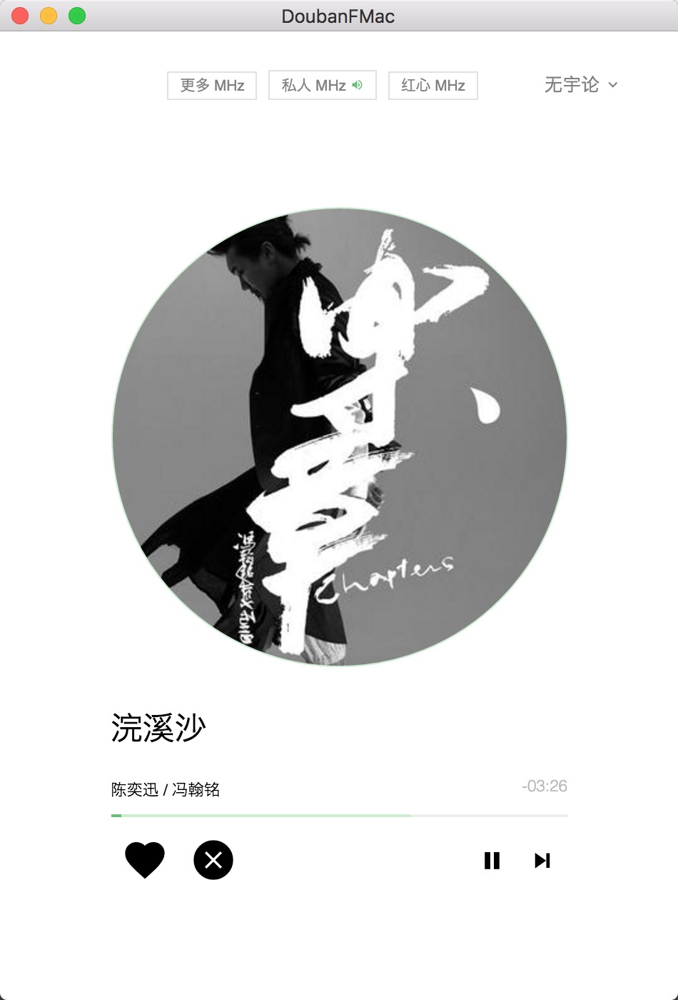
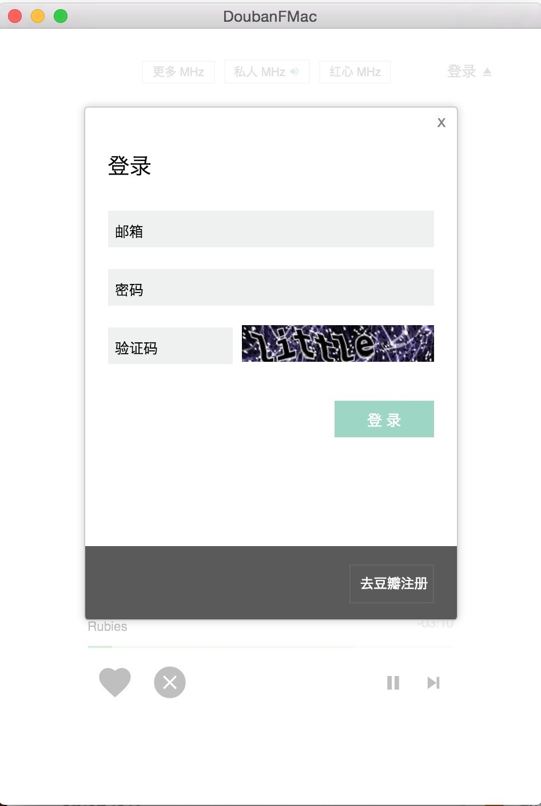

# Douban FMac

[![version][version-image]][version-url]
[![build status][travis-image]][travis-url]
[![coverall status][coveralls-image]][coveralls-url]

A beautiful mac desktop application for [Douban FM](http://douban.fm)

 

   

## Screenshots

## Features

1. play/pause songs on 私人 channel. [`Ctrl+Alt+p`]
2. like songs. [`Crtl+Alt+l`]
3. dislike songs. [`Ctrl+Alt+u`]
4. skip songs. [`Ctrl+Alt+n`]
5. ban songs. [`Ctrl+Alt+b`]

## Download

Download the Mac Desktop Application at [Mac App Releases](https://github.com/Darmody/DoubanFMac/releases)

[travis-image]: https://img.shields.io/travis/Darmody/DoubanFMac/master.svg
[travis-url]: https://travis-ci.org/Darmody/DoubanFMac
[coveralls-image]: https://img.shields.io/coveralls/Darmody/DoubanFMac/master.svg
[coveralls-url]: https://coveralls.io/github/Darmody/DoubanFMac
[version-image]: https://img.shields.io/badge/version-beta-blue.svg
[version-url]: https://github.com/Darmody/DoubanFMac/releases

## Contributing

Feel free to create PR, issues, and fork the repo.

## License

DoubanFMac is released under the [MIT License](http://www.opensource.org/licenses/MIT)
